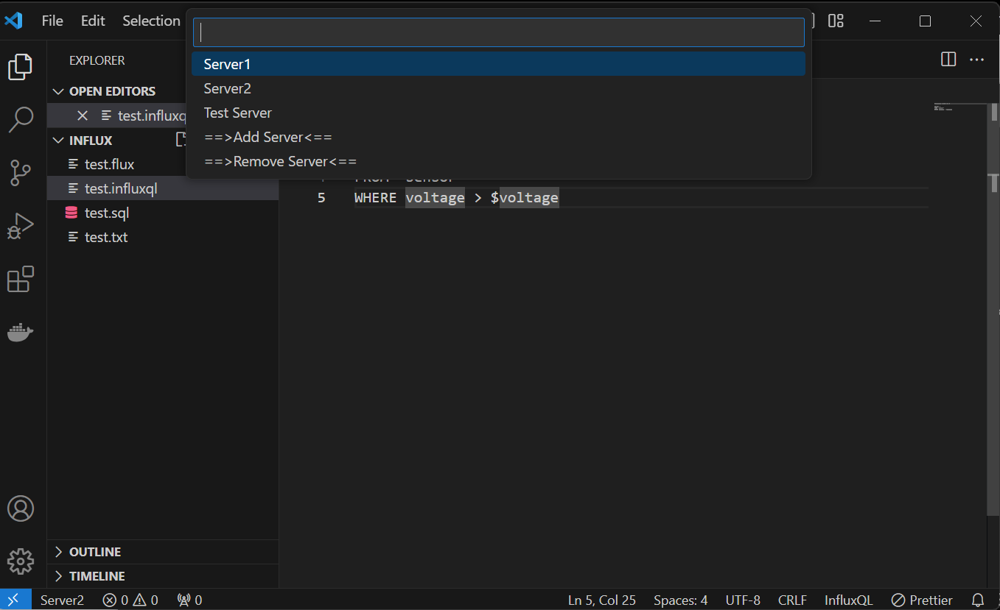
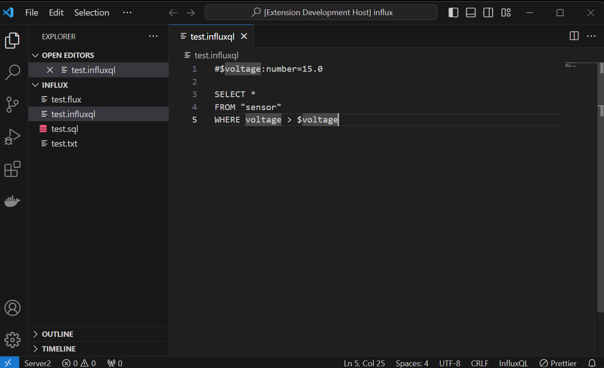

# influxcloudextension README

This Influx cloud extension is intended to make executing SQL, InfluxQL and Flux queries against the cloud version of Influx easier. 

## Features

### Add/Remove servers: 

Click the server in the task bar (or choose the Influx: Select Influx Server command ) to open the menu allowing you to select a server or add a new server. 

### Execute queries with parameters: 

To add parameters to a query add a line with the first two characters '#$'

The format for parameters is 

`#$parametername:parametertype=parametervalue`

The parameter type is optional.  Valid types are string, number and boolean. 

Flux scripts do not allow parameters. 

To execute a script hit F5 or execute the Influx: Execute Influx Query command.  

## Requirements

No additional requirements are identified. 

## Extension Settings

### Output Format - The format used in the output of the query: 
Options are CSV, WeirdCSV and Line Protocol.  
Default is CSV

### Max Rows - The maximum number of rows to display: 
Value is an integer.  If the value is <=0 all results are displayed. 
If the value is >0 then only the set number of results will be displayed. 
Default is 0 
This is useful for testing queries that may return large amounts of data.  

## Known Issues

This is my first time publishing an extension, so you can expect it to get better with future releases. 

The Line Protocol and AnnotatedCSV formats have not been tested as inputs to influx currently. 

## Release Notes

### 1.0.0

Initial release.

### 1.1.0

Added multiple output formats and a setting to limit the maximum number of results displayed. 
The Line Protocol and Annotated CSV formats are not currently consistent with the formats InfluxDB will accept.  In my defense, the documentation of those formats is ... suboptimal.  

Also added some highlighting of the parameters for SQL and InfluxQL queries.  

